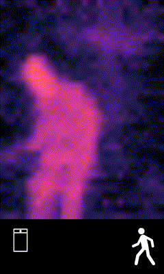
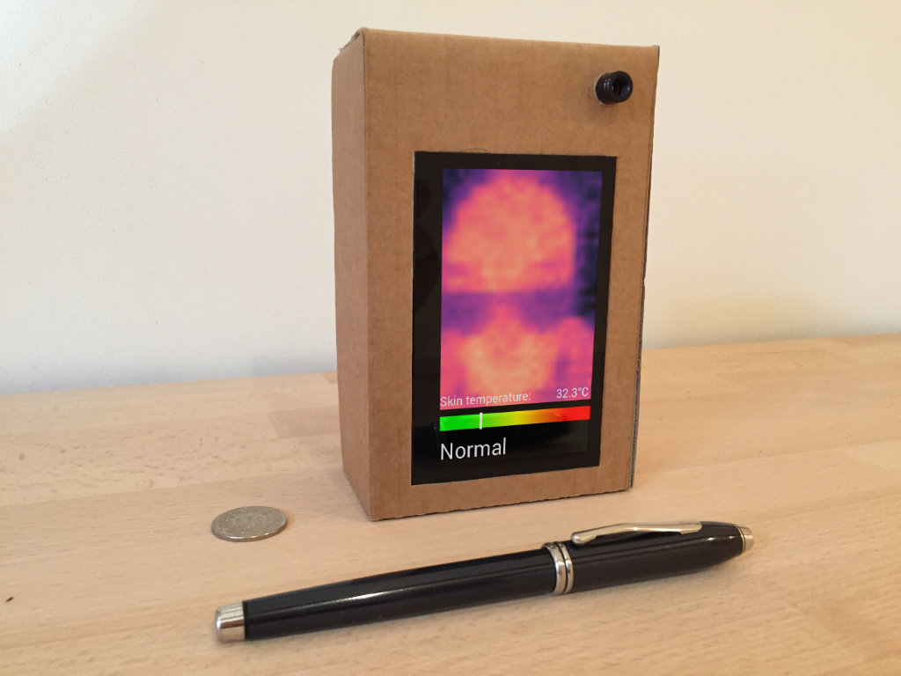

# Skin Temperature Scanner

## Abstract

This project aims to estimate the human body temperature with a
thermal camera connected to a Raspberry Pi computer. Packaged with
a battery and small screen, you can create a portable, handheld
device to have a quick measure if someone has fever or not.

|animation   | device  |
|---|---|
| | |

## Part list

For this prototype, the following hardware has been used:
- Raspberry Pi 2, 3 or 4
- MLX90640 Thermal Sensor, 32x24 px 
- Waveshare 4.3inch HDMI LCD (B), 800x480, IPS
- 5V 2.4A power adapter (2x)
- microSD card 8Gb or larger

## MLX90640 Far infrared Thermal Sensor

The [MLX90640](https://www.melexis.com/en/product/MLX90640/Far-Infrared-Thermal-Sensor-Array) is a thermal camera
made by Melexis N.V. It has a I2C interface, which is perfect for the Raspberry Pi and other embedded devices. You can 
find the C++ API, driver and documentation on their [Github](https://github.com/melexis/mlx90640-library) page.
The company Pimoroni has made a 
[breakout board](https://shop.pimoroni.com/products/mlx90640-thermal-camera-breakout?variant=12536948654163) around this
sensor, for easy integration with a Raspberry Pi.

## Research

| Setting                        | Value                 | Reference |
| ------------------------------ | --------------------- | --------- |
| Emisitivity of human skin      | 0.99                  | [1]       |
| Average human skin temperature | 32-34 degrees Celsius | [2]       |


## Setup the Raspberry Pi

The software is made and tested on Raspbian (Buster). Open `/boot/config.txt` and make the following changes:

```
## Display settings
max_usb_current=1
hdmi_group=2
hdmi_mode=87
hdmi_cvt 800 480 60 6 0 0 0 
# Rotate the screen to portrait mode
display_rotate=3

## Settings for the thermal sensor
dtparam=i2c_arm=on
dtparam=spi=on
# Add support for FPS > 16
dtparam=i2c1_baudrate=1000000
```

If you don't want to make these settings by hand, you can also copy the `resources/boot/config.txt` from this project:

```shell script
cp ./resources/boot/config.txt /boot/config.txt
```
Reboot the computer after changing the config.txt file.

## Dependencies

In the `bin` directory is a script, called `install_dependencies.sh`.


## Download the precompiled binary and run the app

Download the latest [release](https://github.com/gilbertfrancois/skin-temperature-scanner/releasehttps://github.com/gilbertfrancois/skin-temperature-scanner/releases) 
and unpack the application in your preferred location:
```shell script
tar zxvf ThermalCamera_1.0.1_raspbian_buster_armv7l.tar.gz
cd ThermalCamera/bin
./install_dependencies.sh
```
Check the settings in `/boot/config.txt` like described above. There is an example file in `resources/boot/config.txt` in 
this bundle. After changing the config.txt file, reboot the Raspberry Pi.

To run the application:
```shell script
cd ThermalCamera/bin
./ThermalCamera
```

## Build from source

Instead of downloading the precompiled binary, you can download the source files and compile it yourself by following
the steps below:

```shell script
git clone https://github.com/gilbertfrancois/skin-temperature-scanner.git
cd skin-temperature-scanner
./bin/install_dependencies.sh
mkdir build
cd build
cmake ..
make
./ThermalCamera
``` 

## References

[1] [Table of emissivity values in the Infrared](https://www.optotherm.com/emiss-table.htm)

[2] [Temperature of a Healthy Human (Skin Temperature)](https://hypertextbook.com/facts/2001/AbantyFarzana.shtml)

[3] [Raspberry Pi display](https://www.raspberrypi.org/documentation/hardware/display/)

[4] [Waveshare 4.3" display wiki](https://www.waveshare.com/wiki/4.3inch_HDMI_LCD_(B))
